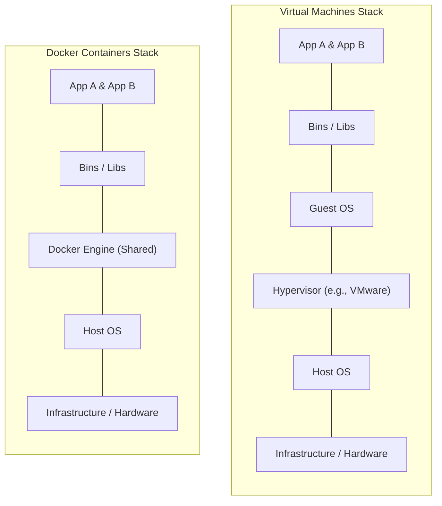
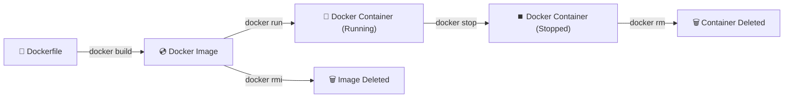

# 🐳 Docker - The Essentials

Welcome to the Docker learning module! This directory contains simple, clear, and hands-on examples to help you understand containerization and how to manage applications in isolated environments.

---

## 💡 What is Docker?

**Docker** is an open-source platform that automates the deployment of applications inside lightweight, portable, and self-sufficient containers. 

### Containers vs. Virtual Machines (VMs)

While Virtual Machines package a full operating system (including the kernel), Docker containers share the host system's kernel, making them much faster, smaller, and resource-efficient:

---

## ⚙️ Core Concepts

To understand Docker, you need to know three main elements:

1. **Dockerfile**: A text file containing a list of instructions on how to build a Docker image. Think of it as a recipe.
2. **Docker Image**: A read-only template that contains the application code, libraries, and dependencies. Think of it as the cooked dish or the blueprint.
3. **Docker Container**: A running instance of an image. If the image is the blueprint, the container is the actual house built from it.
4. **Docker Registry (Docker Hub)**: A cloud repository where developers share and download container images (similar to how GitHub hosts Git repositories).

---

## 🔄 The Container Lifecycle

---

## 📂 Exploring the Examples

To help you get started quickly, we've provided:

- 📋 [**Docker Commands**](commands.md): A clean reference sheet for common container, image, and system clean up commands.
- 🚀 [**Interactive Local Workflow Demo**](basic-demo/README.md): A hands-on script that automatically creates a minimal Dockerfile, builds an image, runs a container, reads logs, and cleans up on your local machine so you can watch Docker work in real-time.
