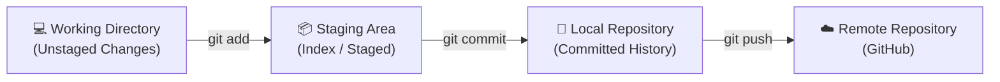

# 🐙 Git & GitHub - The Essentials

Welcome to the Git and GitHub learning module! This directory contains simple, clear, and hands-on examples to help you understand version control and collaboration.

---

## 💡 What is Git vs. GitHub?

It is common to confuse Git and GitHub, but they are two distinct technologies that work together:

| Feature | Git | GitHub |
| :--- | :--- | :--- |
| **What is it?** | A **local tool** (software) installed on your computer. | A **web platform** (cloud service) hosted on the internet. |
| **Purpose** | Tracks changes in your code files and keeps a history. | Hosts your Git repositories online so others can collaborate. |
| **Where it runs** | Offline, locally on your command line or GUI. | Online, on cloud servers. |
| **Key Actions** | `git init`, `git commit`, `git branch`, `git merge` | Creating issues, Pull Requests, Code Reviews, Actions. |

---

## 🛠️ The 3 Stages of Git

Git tracks your files across three main areas. Understanding these stages is the key to mastering Git:



1. **Working Directory (Unstaged)**: This is where you modify your files. Git knows the files have changed but hasn't prepared them to be saved yet.
2. **Staging Area (Staged)**: A draft area where you select and group changes you want to include in your next commit. Think of it as packing a box before shipping.
3. **Local Repository (Committed)**: Once you commit, Git takes a snapshot of your staged files and permanently saves it to the `.git` folder.

---

## 🌿 Branching & Merging

Branching is Git's superpower. It allows you to duplicate your code to work on a feature, bug fix, or experiment without affecting the main working codebase.

- **Main Branch (`main` or `master`)**: The stable, production-ready version of your project.
- **Feature Branch (`feature/xyz`)**: A temporary branch used for developing new features. Once complete, it is merged back into the main branch.

```
       A --- B --- C (main)
            \
             D --- E (feature/new-button)
```

After merging the feature branch, the commits `D` and `E` are integrated into the main line of code.

---

## 🤝 GitHub Collaboration Flow

GitHub makes team collaboration easy through the following workflow:

1. **Fork**: Duplicate someone else's repository to your own GitHub account.
2. **Clone**: Download the repository from your GitHub account to your local computer.
3. **Create Branch**: Create a branch locally to start writing code.
4. **Push**: Send your local commits to your remote repository on GitHub.
5. **Pull Request (PR)**: Ask the original project owner to merge your changes into their main repository.
6. **Code Review & Merge**: Collaborators review your code, suggest changes, and eventually merge it.

---

## 📂 Exploring the Examples

To help you get started quickly, we've provided:

- 📋 [**Git & GitHub Commands**](commands.md): A handy reference for common commands.
- 🚀 [**Interactive Local Workflow Demo**](basic-demo/README.md): A hands-on script that automatically initializes, modifies, commits, branches, and merges in a sandbox directory on your machine so you can watch Git work in real-time.
